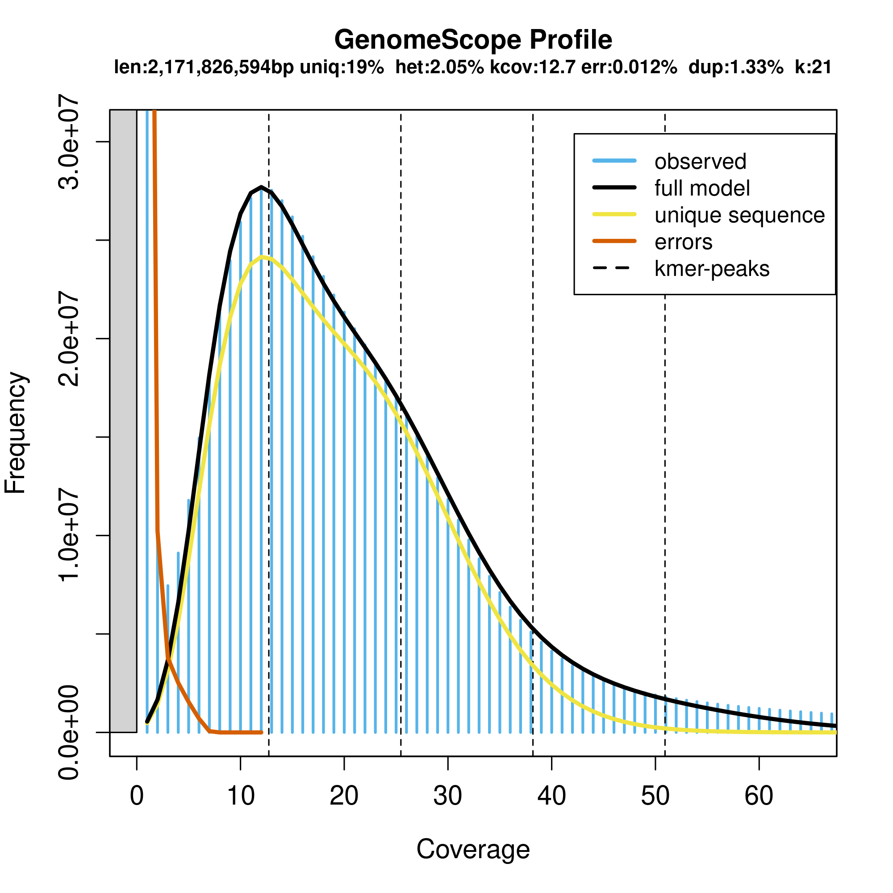

# Part 1, genome survey analysis for Hibbertia_project
**date: 23/06/2022**

## 1 Summary

## 2 File structure

In Phoenix [23/06/2022]
- raw_data: Hibbertia_project_2022/01_raw_data/01_illumina 
- results: Hibbertia_project_2022/02_results/01_genome_survey
- scripts: Hibbertia_project_2022/03_scripts/01_genome_survey
- jobs: /hpcfs/users/a1183549/Hibbertia_project_2022/04_jobs/01_genome_survey

## 3 Methods and results

### 3.1 QC for raw reads

[23/06/2022]

**Packages:**
- FastQC (v0.11.9)

**Scripts:**
1. 01_01_run_fastqc.sh
**Jobs:**
1. 01_01_job_fastqc.sh

**Runtime:**
1. 06:02:36 (16 cpus)

### 3.2 Trim adaptor and low-quality sequences

[23/06/2022]

**Packages:** 
- bbduk in BBMap (v38.96)
- FastQC (v0.11.9)

**Scripts:** 
1. 01_02_run_bbduk.sh

**Jobs:**
1. 01_02_job_bbduk.sh

**Runtime:**
1. 05:32:42 (16 cpus)

**Results:**

The following table (Table 1 ) summarise the number of raw reads and clean reads.

|  | Lane001 | Lane002 | Total |
|------------------------|--------------|--------------|--------------|
| Raw_reads              | 734,525,722    | 673,509.272    | 1,408,034,994   |
| Raw_bases              | 180,533,430,032 | 165,375,181,609 | 345,908,611,641 |
| Clean_reads            | 609,292,914    | 555,133,394    | 1,164,426,308   |
| Clean_reads_percentage | 82.95%       | 85.42%       | 82.70%       |
| Clean_bases            | 119,299,432,547 | 108,582,008,665 | 227,881,441,212 |
| Clean_bases_percentage | 66.08%       | 65.66%       | 65.88%       |
Table: Summary of illumina reads.

### 3.3 Count kmer frequencies using Jellyfish

[24/06/2022]

**packages:**
- Jellyfish (v2.2.7)

**Scripts:**
1. 01_03_run_jellyfish.sh

**Jobs:**
1. 01_03_job_jellyfish.sh

**Runtime:**
1. 06:59:44 (16 cpus)

**Note:**
Job for kmer=12 failed due to out of memory issue (memory = 128Gb). Therefore kmer=12 was ignored in following anaysis.

### 3.4 Genome survey using genomescope

[27/06/2022]

**packages:**
- genomescope.R (v1, externalScripts)

**Scripts:**
1. 01_04_run_genomescope.sh

**Jobs:**
1. This step was carried out in freebie, because genomescope requires X11.

**Runtime:**
1. 5 mins (1 cpus)

### 3.5 Genome size estimation using estimate_gSize_kmer

[27/06/2022]

**packages:**
- estimate_gSize_kmer.R (in house R script, externalScripts)

**Scripts:**
1. 01_05_run_estimate_gSize_kmer.sh

**Jobs:**
1. This step was carried out in freebie.

**Runtime:**
1. 1 min (1 cpus)

**Results:**

The 21-mer frequencies of clean illumina reads is shown in following figure (Figure 1). In this figure, the X axis (Coverage) represents the 21-mers with a certern coverage, and the Y axis (Frequency) represents the frequencies (number of 21-mers) with a certern coverage. You normally can see two peaks (black lines) in a diploid genome, which are corresponding to estimated sequenced coverage for diploid (first peak) or haploid (second peak, which is normally two times of the first peak) genomes. In this figure, we can clearly see the first peak (~13 at X axis), and vaguely see the 2nd peak (at ~26 in X axis). 

Based on the 21-mers coverage distribution, the estimated genomics statistics are shown in following Table 2. The result indicated that the estimated genome size is ~2.17 Gb, and possibly with a very high coverage of repetitive elements (> 80%), and high heterozygosity rate (> 2.04%).

| property | min | max |
| ------- | ------- | ------- |
|Heterozygosity | 2.0456% | 2.05339% |
|Genome Haploid Length | 2,168,787,725 bp | 2,171,826,594 bp |
|Genome Repeat Length | 1,757,377,894 bp | 1,759,840,303 bp |
|Genome Unique Length | 411,409,831 bp | 411,986,291 bp |
|Model Fit | 88.9634% | 97.9604% |
|Read Error Rate | 0.0120185% | 0.0120185% |
Table: Summay of genome survey analysis.

## 4 Additional information
